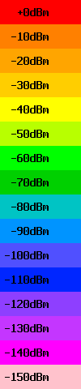
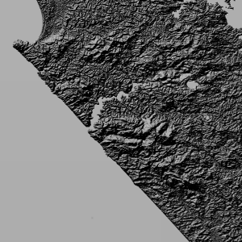

Wavetrace
*************
Wavetrace is a Python 3.5 package designed to produce radio signal coverage reports, such as GeoTIFF files of signal strength contours,

.. image:: docs/images/signal_strength_contours.png
    :width: 350px
    :align: left

given radio transmitter data and topography data around the transmitters.
It uses `SPLAT! <http://www.qsl.net/kd2bd/splat.html>`_ to predict the attenuation of radio signals, which implements a `Longley-Rice model <https://en.wikipedia.org/wiki/Longley%E2%80%93Rice_model>`_.

Wavetrace can also compute line-of-site maps for geostationary satellites:

Wavetrace is intended for use in New Zealand but can be configured to work elsewhere on Earth. 
 

Installation
============
1. Install SPLAT! >= 1.4.0, GDAL >= 1.11, and ImageMagick. For example, to install these on a Linux system do ``sudo apt-get update; sudo apt-get install splat gdal-bin python-gdal imagemagick``
2. Create a Python 3.5 virtual environment
3. In your virtual environment, install Wavetrace via Pip via ``pip install wavetrace``

Usage
=========
Here is a common workflow for computing radio signal coverage reports for terrestrial transmitters.

#. Create a CSV file containing transmitter data; see ``tests/data/transmitters.csv``
#. Process the transmitter data into SPLAT! files via the function ``wavetrace.main.process_transmitters``
#. Download topography data around the transmitters via the functions ``wavetrace.main.compute_tiles`` and ``wavetrace.main.download_topography``.  Topography data comes in two flavors: SRTM3 (standard definition; 3 arc second resolution; roughly 66 meters at 45 degrees south latitude) or SRTM1 (high definition; 1 arc second resolution; roughly 22 meters at 45 degrees south latitude). SPLAT! can only handle those two formats.
#. Process the topography data into SPLAT! files via the function ``wavetrace.main.process_topography``
#. Compute signal coverage reports, which include GeoTIFF signal strength contour maps, from the processed transmitter and topography data via the function ``wavetrace.main.compute_coverage``

See the IPython notebook ``ipynb/examples.ipynb`` for a detailed example.

Additionally, you can call the most useful functions in the module ``wavetrace.main`` through Wavey, a command line interface for Wavetrace implemented in the module ``wavetrace.cli``.

Documentation
==============
In ``docs`` and on Rawgit `here <https://rawgit.com/araichev/wavetrace/master/docs/_build/singlehtml/index.html>`_

Further Reading
================
- `SPLAT! documentation <http://www.qsl.net/kd2bd/splat.pdf>`_
- `Open Street Map wiki page on SRTM data <https://wiki.openstreetmap.org/wiki/SRTM>`_

Authors
=======
- Chris Guest (2013-06)
- Alex Raichev (2016-08)
